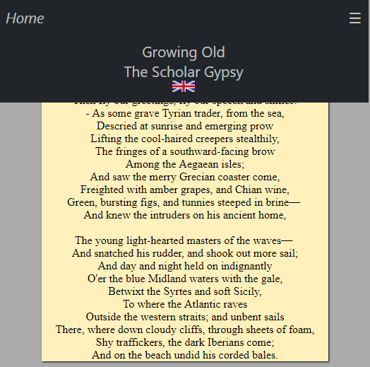
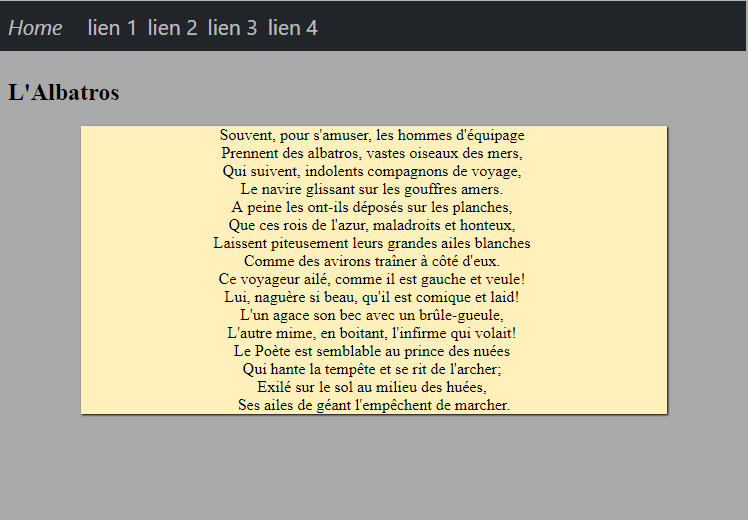
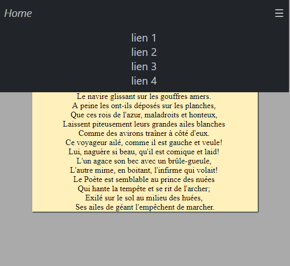
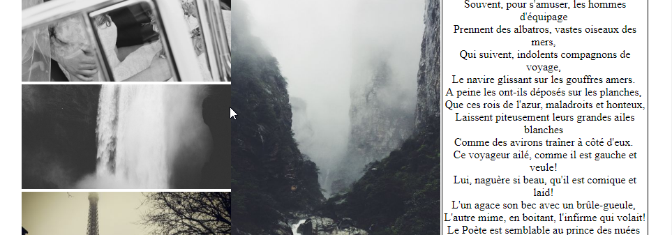
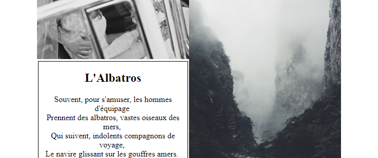

# html Elements
html part of codes

## full example:
An example is available for testing all, and small code for testing each elements.



## colour picker:
This small code will display a colour picker (found on [w3c](https://www.w3schools.com/colors/colors_picker.asp) and simplified).


maybe you should modify the ```margin-bottom``` property of `selectedhexagon` to perfectly align selector.

## post-it:
This will create a [post-it](http://creative-punch.net/2014/02/create-css3-post-it-note/) like render.


## country selector:
This will display a flag selector to change display language easily, you can modify it simply by adding new flags or removing existent.


It was created with the least possible Javascript, and to use HTML5 and CSS3 tricks.

## nav barre:
This will provide a small navigation barre responsive and customisable




## smoothScroller:
This part of code will provide a smooth scrollbar on link select, with a displacement in 0.3 second.

## carousel:
This part of code is to create a carousel


If you click once on the arrow, the display will be continue, you should click another time on the carousel to stop it.

To change only one image, you shoud click twice.

To modes exists for carousels, the first one only allow to change images one by one:

```HTML
<div id="carouselID" class="carousel">
	<div class="navBarre" onclick="carousel.continus = false;">
		<div class="arrow left"><span class="left" onclick="carousel.previous(this)">&lt;</span></div>
		<div class="arrow right"><span class="right" onclick="carousel.next(this)">&gt;</span></div>
	</div>
</div>
```

The second one allow to create a infinite sliding carousel

```HTML
<div id="carouselID" class="carousel">
	<div class="navBarre" onclick="carousel.continus = false;">
		<div class="arrow left"><span id="carouselLeft" class="left">&lt;</span></div>
		<div class="arrow right"><span id="carouselRight" class="right">&gt;</span></div>
	</div>
</div>
```

```Javascript
document.getElementById( "carouselLeft" ).addEventListener( "click", function( ev )
{
	if ( carousel.previous ( ev.target, true ) )
	{
		ev.stopPropagation ( );
	}
});

document.getElementById( "carouselRight" ).addEventListener( "click", function( ev )
{
	if ( carousel.next ( ev.target, true ) )
	{
		ev.stopPropagation ( );
	}
});
```

## grid:
This part of code provide a mecanism to feed a grid automaticly with content defined staticly without care about alignment.




## dark-light :
This part of code allow two them colors for the page.

The global CSS shouldn't include color rules, they should be add in two external CSS file and sourced in function of the selector.

```HTML
<head>
	<link id="lightCss" rel="stylesheet" href="/css/colorDark.css">
</head>
```

```Javascript
function changeLight ( flag )
{
	if ( flag )
	{ // light mode
		document.getElementById ( 'lightCss' ).href = '/css/colorLight.css';
	}
	else
	{ // dark mode
		document.getElementById ( 'lightCss' ).href = '/css/colorDark.css';
	}
}
```

obviouly you can add CSS in the main page as in exemple:

```HTML
<head>
	<style id="lightCss"></style>
</head>
```

```Javascript
function changeLight ( flag )
{
	if ( flag )
	{ // light mode
		document.getElementById ( 'lightCss' ).innerHTML = '.onlyDark{display:none;}';
	}
	else
	{ // dark mode
		document.getElementById ( 'lightCss' ).innerHTML = 'body{color: #fdf6e3;background-color: #333;}.onlyLight{display:none;}';
	}
}
```